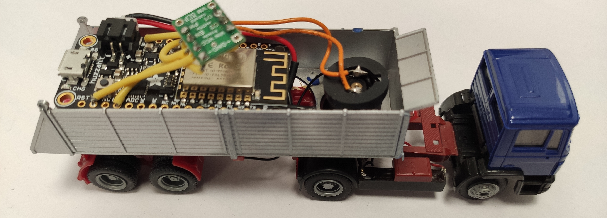
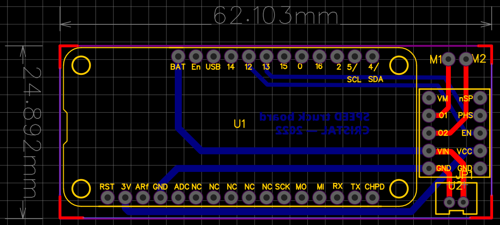

# SPEED_Trucks #

Take control of modified Faller Car System trucks from a Raspberry Pi in AP mode, using python and UDP packets.

First, we need to configure the raspberry pi in AP mode, so it can hosts the "SPEEDTRUCKS" Wi-Fi, which the truck connects to. The truck starts listening for UDP packets using port 4210 and we just need to send them with python. I'll try to create a library for a better (further) use. 

## Board and components for the truck upgrade ##
The first truck made is not really convenient to use in the SPEED project. The trucks are intended to carry containers, but there's no space left because of the electronics. That's why I designed a board to carry all the electronics, so it can fit in a 3D-printed case that, once attached on a truck, can carry containers again.

<div align="center"><br>
<i>The first modified truck</i><br>
<br>
<i>The truck that needs to be modified</i><br>
<br>
<i>The designed board for the electronics</i><br></div>

**List of components**

| Component | Reference |
| ------ | ------ |
| Main board (ESP8266) | Adafruit Huzzah Feather ESP8266 |
| Motor bridge | POLOLU DRV8838 |
| LiPo cell | anything around 3,7V |

You can find the board files for EasyEDA, BOM and gerber files in main/speed_truck_board/

The board is programmed in Arduino (C++), I used the PlatformIO VSCode extension for it but you'll find the code in /speed_truck_esp8266/src/main.cpp

## Arduino code to set up the WiFi connection and open UDP port ##

```cpp
#include <ESP8266WiFi.h>
#include <WiFiUdp.h>

//AP Credentials
const char* ssid = "SPEEDTRUCKS";
const char* pwd = "speedtrucks";

#define UDP_PORT 4210

WiFiUDP UDP;

char packetBuffer[UDP_TX_PACKET_MAX_SIZE];
char cmd;

void setup() {  

WiFi.begin(ssid, pwd);
UDP.begin(UDP_PORT);

UDP.parsePacket();

  if(UDP.read(packetBuffer, UDP_TX_PACKET_MAX_SIZE)) {
    cmd = packetBuffer[0];
    switch (cmd) {    
        case /*char*/ :
            /* code */
            break;
    
        default:
            /*Code to execute when the value is not a case you put in the statement*/
            break;
    }
  }
}
```

## Setting up the Raspberry Pi (AP Mode) ##
This step is a bit tricky as config may not work at the first attempt. Here's some guides to help make it work.

_need to complete here_
First, we need to install hostapd and dnsmasq to configure the Pi 
```
sudo apt-get install hostapd dnsmasq
```

Then we need to stop these just to be sure as we're going to modify their config files 
```
sudo systemctl stop dnsmasq
sudo systemctl stop hostapd
```

We have to set a static IP address with dhcpcd by editing the dhcpcd.conf file 
```
sudo nano /etc/dhcpcd.conf
```

Go to the end of the file and add/edit to something like this : 
```
---
```

<details><summary>Links</summary>
https://thepi.io/how-to-use-your-raspberry-pi-as-a-wireless-access-point/ <br/>
https://raspberrypi-guide.github.io/networking/create-wireless-access-point#configure-the-access-point-host-software <br/>
https://www.raspberryconnect.com/projects/65-raspberrypi-hotspot-accesspoints/168-raspberry-pi-hotspot-access-point-dhcpcd-method
</details>

## Controlling the truck(s) (Python3) ##
The idea is to send a character through a UDP packet sent by the raspberry pi.

**Library used to send the packet**
```
import socket
```
**Sending a packet** 

_replace MESSAGE by the variable or character you want to send_

```python
#Create socket
sock = socket.socket(socket.AF_INET, socket.SOCK_DGRAM)
#Encode and send a message over UDP (to specified IP on specified port)
sock.sendto(MESSAGE.encode(), (UDP_IP, UDP_PORT))
```
